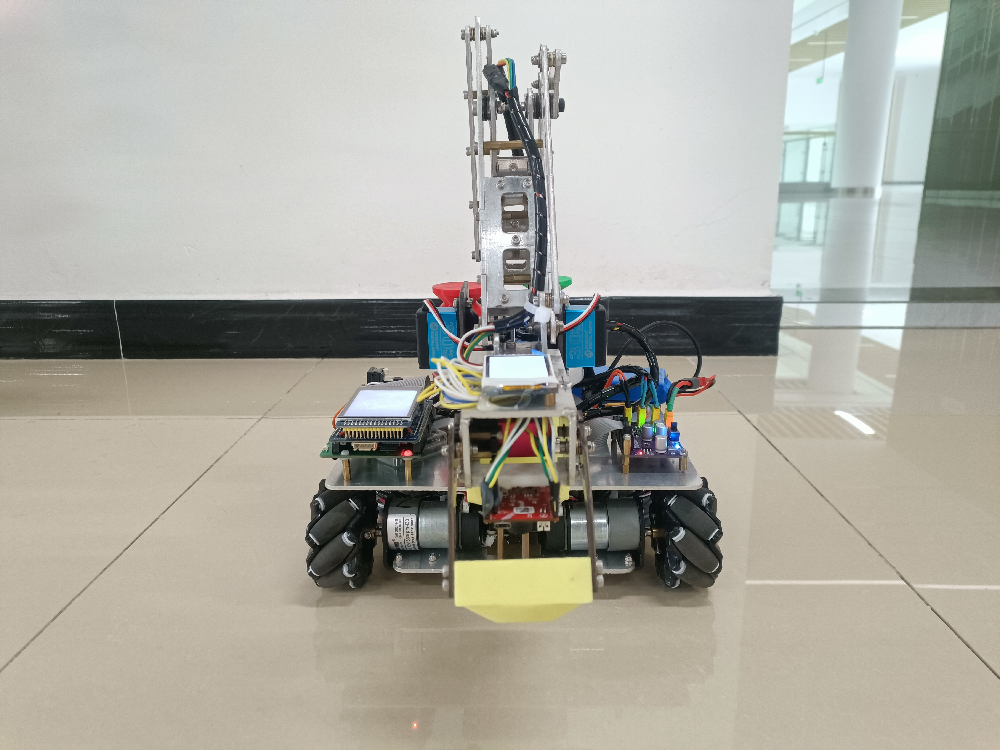
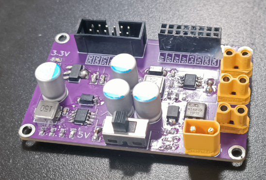
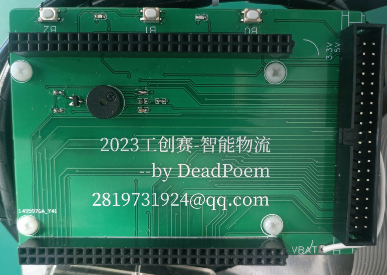
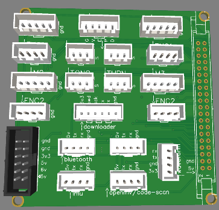
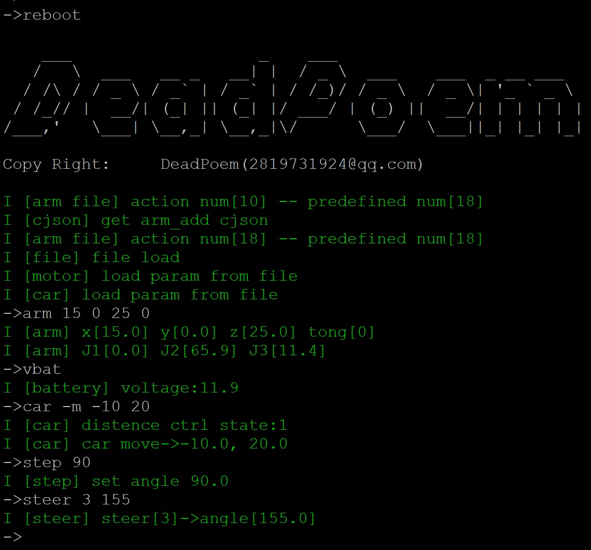
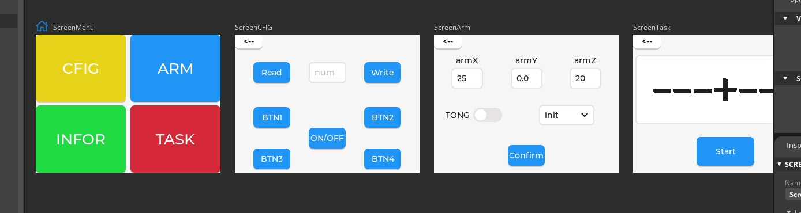
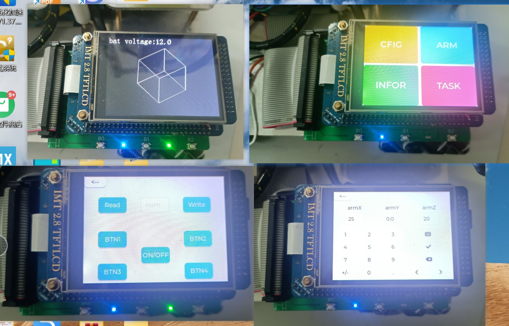
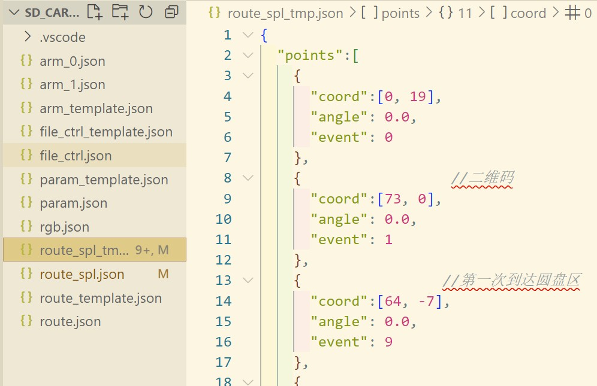
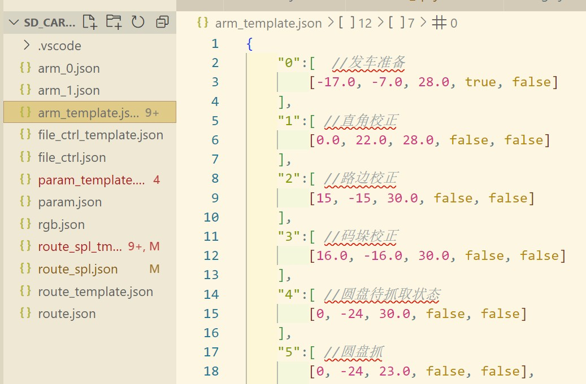
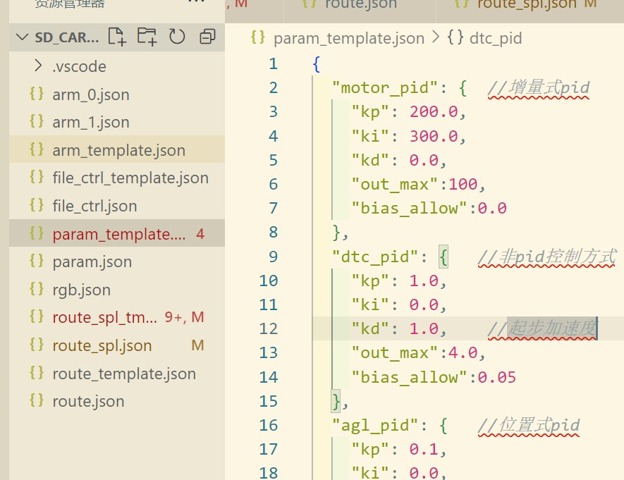

**2023工训赛-智能物流-开源 西南石油大学(成都)-SWPU飞翔队**

前言:
> 先说成绩, 省赛决赛第4, 但是在我们前面的队伍有不少用了套件emmm....不好评价. 毕竟是做了大半年的东西, 在此做个记录总结, 顺便整理了一下资料开源给感兴趣的伙伴(愿以后的比赛少一点套件车模, 多一点公平快乐),博主我水平有限, 肯定是有不少缺陷的, 各位将就着看个乐子

*目录*
[TOC]
# 资料
[gitee仓库传送门](https://gitee.com/dead-poem/intelligent-logistics-chassis)
> 文件夹说明:
> 
> lvgl_squareline_pro   //lvgl的squareline ide工程
> 
> stm32_code_pro        //stm32工程, 基于cubemx ide
> 
> sd_files              //插入stm32核心板的sd卡中的文件(存储控制参数)

[立创开源链接](https://oshwhub.com/ming_yao_yang/zhi-neng-wu-liu-dian-yuan_copy)
> 只开源了电源模块, 其它都是接插口pcb没有参考价值

[演示视频传送门](https://www.bilibili.com/video/BV1zu4y1W7rn/?vd_source=6c6ddc65aa9a516f6055f95eb2779c53)
> 比赛视频忘了录制, 实际比赛机器人速度比b站的校赛视频快的多

[国赛方案](https://gitee.com/dead-poem/intelligent-logistics-chassis/tree/v1.1/)
> openmv更换为树莓派(处理方案不变，通信机制不变)， 机械臂步进电机更换为伺服电机， 其余变化不大

[国赛方案演示](https://www.bilibili.com/video/BV1Ta4y1Z73z/?vd_source=6c6ddc65aa9a516f6055f95eb2779c53#reply197947542368)

# 方案 
先来几张帅照

整体方案: 硬件配置方面, stm32作为主控, openmv作为视觉, 底盘是普通的直流编码器电机+麦克纳姆轮, 机械臂是经典的码垛机械臂. 定位依靠编码器进行积分, 然后再利用openmv视觉进行纠偏, 还装有一个陀螺仪来进行航向角度反馈, 但是也存在误差需要靠视觉纠偏.

## 电路
自制电源模块, 12V输入, PMOS作为电源开关, 12分流给电机供电, 6V输出给舵机供电, 3.3V/5V输出给传感器模块供电

核心板拓展板, 引出所用引脚, 板载按键,蜂鸣器,led

专门设计的接口pcb, 将所有接插口集中, 便于接线, 拆装方便

## 电控
机器人控制功能依靠stm32实现, 我使用的是stm32F07ZGT6, 本着学习的目的, 除了现实比赛任务的基本功能外, 我也还实现了一些其它功能拓展技能点, 如果正在看这篇文章的你只是刚开始搞比赛玩, 那么你只需要能够实现基本功能即可, 无须纠结拓展功能. 本工程围绕stm32使用到了freertos, lvgl, fatfs32文件管理系统, cjson等第三方功能包.下面对于各功能及其对应工程文件做一个简单介绍, 具体源码存放在前面的开源仓库中.
### 基本功能:
实现基本功便足以较好的完成比赛任务
#### 按键, led, 蜂鸣器
~~~
stm32_code_pro/User/my_lib/button.c
stm32_code_pro/User/my_lib/led.c
stm32_code_pro/User/my_lib/beep.c
~~~
最基础的莫过于按键, led, 蜂鸣器, 用于进行人机交互, 提示, led闪烁还是很有必要的, 可以第一时间观察到系统是否死机, 便于调试

#### 电机速度闭环
~~~
stm32_code_pro/User/my_lib/motor.c
~~~
底盘控制的第一件事便是先实现电机控速, 我采用的是增量式pid(PI)速度闭环.pid控制网上教程一大把, 这里不做介绍了, 核心也就几行代码实现还是比较简单的. 因为是要控制四个电机, 所以定义了一个电机控制结构体, 提前定于了一个数组存放四个电机控制块.
~~~
/// @brief 增量式PID速度控制
/// @param pMotor 
static void SpeedControlOne(Motor_Type* pMotor, uint16_t PassTick_ms)
{
    if(pMotor->PID.PIDCtrl_Flag)
    {
        pMotor->PID.Present = pMotor->Speed;
        pMotor->PID.Bias = pMotor->PID.Target - pMotor->PID.Present;
        //除以采样时间, 减小采样时间变化的影响
        pMotor->PID.Output += (pMotor->PID.Kp*(pMotor->PID.Bias-pMotor->PID.LastBias) + pMotor->PID.Ki*pMotor->PID.Bias)/PassTick_ms;
        pMotor->PID.LastBias = pMotor->PID.Bias;
        //限幅
        if(pMotor->PID.Output < -pMotor->PID.OutLimit){
            pMotor->PID.Output = -pMotor->PID.OutLimit;
        }else if(pMotor->PID.Output > pMotor->PID.OutLimit){
            pMotor->PID.Output = pMotor->PID.OutLimit;
        }

        MotorSetPwm(pMotor->MotorId, (int8_t)pMotor->PID.Output);
    }else
    {
        MotorSetPwm(pMotor->MotorId, 0);
    }
}
~~~

#### 方向闭环(陀螺角度获取+闭环控制)
~~~
stm32_code_pro/User/wit_c_sdk/jy901.c
stm32_code_pro/User/my_lib/car_ctrl.c
~~~
即使四个电机速度能完全一样, 也会因为机械结构的问题出现打滑等情况无法实现长时间直行行走, 而且我们使用的还是直流电机而不是步进电机, 即使有速度闭环四个轮子转的也不可能完全一样, 所以我们还得加入方向反馈来进行角度控制.我们使用的是维特智能的角度传感器, 自带解算, 串口通信获取角度, 再根据反馈角度来进行闭环控制, 这里使用的位置式pid(PD). 为了防止在车不动的情况下, 车辆因为小角度偏差而出现不断调整振荡的情况, 这里引入了一个误差允许量, 当误差小于该范围, 则强行输出为0.
~~~
/// @brief 位置式, 方向pid控制
/// @param PassTick 
static void AnglePID_Ctrl(uint16_t PassTick)
{
    static uint8_t flag =0;
    if(IsIMU_Start() && !flag)  //以IMU初始化角度作为小车初始角度
    {
        flag =1;
        AnglePID.Target = GetYaw();
        // MY_LOGD("car", "angle pid tar->%.1f", GetYaw());
    }
    else if(!IsIMU_Start())
    {
        return;
    }

    AnglePID.Present = GetYaw();
    AnglePID.LastBias += AnglePID.Bias;   //last_bias用作bias累加项
    AnglePID.Bias = AnglePID.Target - AnglePID.Present;
    if(AnglePID.Bias >= 180) AnglePID.Bias -= 360;
    else if(AnglePID.Bias <= -180) AnglePID.Bias += 360;

    //小车静态下避免角度调整造成的原地振荡
    if(fabs(AnglePID.Bias)<fabs(AnglePID.BiasAllow) && fabs(coord_ctrl.DisPID.Bias) < fabs(coord_ctrl.DisPID.BiasAllow)){  
        AnglePID.Output = 0;
         AnglePID.LastBias  = 0;
         AnglePID.BiasSum = 0;
    }
    else{
        AnglePID.BiasSum += AnglePID.Bias;
        AnglePID.Output = AnglePID.Kp*AnglePID.Bias + AnglePID.Ki*AnglePID.BiasSum;
    }
    //限幅
    if(AnglePID.Output > AnglePID.OutLimit) AnglePID.Output = AnglePID.OutLimit;
    else if(AnglePID.Output < -AnglePID.OutLimit) AnglePID.Output = -AnglePID.OutLimit;
}
~~~

#### (x,y)坐标移动控制
~~~
stm32_code_pro/User/my_lib/car_ctrl.c
~~~
前面已经实现了速度控制和方向控制, 在进行速度闭环控制的时候, 我们顺带还能记录每个电机的里程(编码器积分). 根据麦轮小车的移动特性, 我们既可以根据移动方向计算出每个电机的速度, 也可以根据每个电机的里程倒推出它在x/y两个方向的行进距离, 基于此便可以对小车进行坐标移动控制. 为了使得位移更加平滑, 我们使用了加减速控制. 加减速的原理也很简单, 大家应该还记得高中物理的一个公式吧"v2 = 2ax", 最大速度"v"以及加速度"a"都是由我们自己来定义, 根据此公式既可以计算出加减速距离, 然后再根据当前行进距离来进行速度控制, 此处代码比较繁杂, 具体实现请参见源码.
~~~
void SetMoveCoord(float x, float y) //设置目标移动位置, 并计算控制参数, 其中包括加减速距离
static void MotorDistance2Car() //根据每个电机的里程解算移动距离
static void CoordPID_Ctrl(uint16_t PassTick) //坐标位移控制
~~~

#### 舵机控制
~~~
stm32_code_pro/User/my_lib/steer.c
~~~
舵机控制本来是比较简单的, 给个pwm就能控制角度, 但是为了使得机械臂控制更加丝滑, 这里采用角度步进变化的方法, 即每间隔一段时间控制舵机变化一定角度, 避免角度变化过于激烈.
~~~
void SteerTask(void* param)
{
    SteerInit();
    while(1)
    {
        if(!steerEnFlag){  //默认上电不自动使能舵机
        __HAL_TIM_SET_COMPARE(&MAIN_STEER_TIM, MAIN_STEER_CHANNEL, 0);
        __HAL_TIM_SET_COMPARE(&SECOND_STEER_TIM, SECOND_STEER_CHANNEL, 0);
        __HAL_TIM_SET_COMPARE(&TONG_STEER_TIM, TONG_STEER_CHANNEL, 0);
        __HAL_TIM_SET_COMPARE(&TURN_STEER_TIM, TURN_STEER_CHANNEL, 0);

        vTaskDelay(10);
        continue;
        }

        if(steers[0].state || steers[1].state || steers[2].state || steers[3].state)
        {
            for(uint16_t i=0; i<STEER_NUM; i++)
            {
                if(!steers[i].state){  //未置位工作状态, 退出
                    continue;
                }

                if((GetSysTick()-steers[i].last_tick) >= steers[i].step_tick){
                    steers[i].last_tick = GetSysTick();
                }
                else{
                    continue; //未到时间, 退出
                }

                // MY_LOG_Print("\r\nsta:%d tick:%d", sta, steers[i].step_tick);

                if(steers[i].pre_angle == steers[i].tar_angle){  //已达到目标角度, 退出
                    steers[i].state = 0;
                    continue;
                }
                else if(fabs(steers[i].pre_angle-steers[i].tar_angle) < steers[i].step_angle){
                    steers[i].pre_angle = steers[i].tar_angle;
                    steers[i].state = 0; 
                }
                else if(steers[i].tar_angle > steers[i].pre_angle){
                    steers[i].pre_angle += steers[i].step_angle;
                }
                else
                {
                    steers[i].pre_angle -= steers[i].step_angle;         
                }
                SteerAngle2PWM(i, steers[i].pre_angle);
            }
            vTaskDelay(2);
        }
        else{
            vTaskDelay(20);
        }
    }
}
~~~

#### 步进电机控制(梯形加减速)
~~~
stm32_code_pro/User/my_lib/step_motor.c
stm32_code_pro/User/my_lib/step_trape.c
~~~
我们使用的是闭环步进电机驱动器(不会发生丢步), 采用的是脉冲控制, 虽然使用的是闭环驱动, 但为了机械臂启停更加平稳, 我们采用了梯形减速控制算法. 关于算法原理以及具体实现, 可以参考这篇博客[步进电机梯形加减速](https://blog.csdn.net/yingzhefengyuzou/article/details/127707307?spm=1001.2014.3001.5506)

#### 机械臂控制
~~~
stm32_code_pro/User/my_lib/arm.c
~~~
我们使用的是码垛机械臂, 机械臂坐标解算比较简单, 具体原理参考[机械臂解算](https://blog.csdn.net/kanbide/article/details/125870326)
~~~
void Inverse(arm_t* _arm)
{
	float L, LL, LV;
	float gama, alpha, beta;
    if (_arm->x == 0 && _arm->y >0) {    //避免被除数为零
        _arm->J1 = 90;
        L = _arm->y;
    }
    else if (_arm->x == 0 && _arm->y < 0) {
        _arm->J1 = -90;
        L = -_arm->y;
    }
    else {
        if(_arm->x > 0){
            _arm->J1 = atan(_arm->y / _arm->x);
            L = _arm->x / cos(_arm->J1);
            _arm->J1 = PI2AG(_arm->J1);
        }
        else{
            _arm->J1 = atan(_arm->y / _arm->x);
            L = fabs(_arm->x / cos(_arm->J1));
            _arm->J1 = PI2AG(_arm->J1);
            if(_arm->y > 0){
                _arm->J1 += 180;
            }
            else{
                _arm->J1 -= 180;
            }
        }

    }

    LL = sqrt((L - _arm->L3) * (L - _arm->L3) + (_arm->z - _arm->L0) * (_arm->z - _arm->L0));
    gama = acos((_arm->L1 * _arm->L1 + _arm->L2 * _arm->L2 - LL * LL) / (2 * _arm->L1 * _arm->L2));
    gama = PI2AG(gama);

    alpha = acos((_arm->L1*_arm->L1 + LL*LL - _arm->L2*_arm->L2) / (2*LL*_arm->L1));
    alpha = PI2AG(alpha);

    LV = sqrt(_arm->z*_arm->z + (L-_arm->L3)*(L-_arm->L3));
    beta = acos((LL*LL + _arm->L0*_arm->L0 - LV*LV) / (2*LL*_arm->L0));
    beta = PI2AG(beta);
    _arm->J2 = 360 - beta - alpha - 90;
    _arm->J3 = _arm->J2 - gama;
}
~~~

#### openmv通信
~~~
stm32_code_pro/User/my_lib/communication.c
~~~
openmv除了识别物块颜色以外, 还需要完成位置,航向校正的功能, 其中涉及到不同类型的数据传输, 所以stm32与openmv的通信不可能依靠单个的字符来进行通信, 所以我们单独规定了一种通信协议"帧头+数据长度+数据id+数据1+数据2+...+数据n+校验码", 校验采用常用的CRC检验方式. 采用这种方式openmv便可以与stm32自由发送数据内容, 只需要按照事先规定好的方式来解读数据即可

#### 视觉位置校正
~~~
stm32_code_pro/User/my_lib/car_ctrl.c
stm32_code_pro/User/my_lib/route.c
~~~
前面实现的坐标位移控制只能移动到大概位置, 必然会存在误差, 所以由openmv识别赛道上的特殊元素(比如圆环, 直角)来进行位置调节, 根据摄像头中心距离特殊点的x/y偏移量来控制车辆在x/y方向移动调节.
~~~
/// @brief 位置校正pid控制
/// @param PassTick 
static void PosAdjustPID_Ctrl(uint16_t PassTick)
{
    if(gDistenceCtrl){   //进行位置校正时,应停止距离pid控制
        MY_LOGE("car", "distance pid is run when pos adjust");
        return;
    }
    Pos_PID.Bias =sqrt(pos_adjust.x_bias*pos_adjust.x_bias + pos_adjust.y_bias*pos_adjust.y_bias); //由坐标计算偏差距离
    if(fabs(Pos_PID.Bias) <= fabs(Pos_PID.BiasAllow)){  //避免原地振荡
        Pos_PID.Output = 0;
    }
    else{
        Pos_PID.Output = Pos_PID.Kp*Pos_PID.Bias;
    }
    Pos_PID.LastBias = Pos_PID.Bias;
    //输出限幅
    if(Pos_PID.Output > Pos_PID.OutLimit)
    {
        Pos_PID.Output = Pos_PID.OutLimit;
    }else if(Pos_PID.Output < -Pos_PID.OutLimit)
    {
        Pos_PID.Output = -Pos_PID.OutLimit;
    }

    double rad;
    if(pos_adjust.x_bias == 0){
        if (pos_adjust.y_bias > 0) rad = PI/2;
        else  rad = -PI/2;
    }
    else{
        rad = atan(pos_adjust.y_bias/pos_adjust.x_bias);
        if(pos_adjust.x_bias<0 && pos_adjust.y_bias>=0)
            rad += PI;
        else if(pos_adjust.x_bias<0 && pos_adjust.y_bias<0)
            rad -= PI;
    }
    float x_speed, y_speed;
    x_speed = Pos_PID.Output*cos(rad);
    y_speed = Pos_PID.Output*sin(rad);
    //设置速度(角度环控制任然存在, 采用并联输出)
    CarMotorSpeed[0] += (-x_speed+y_speed);
    CarMotorSpeed[1] += (-x_speed-y_speed);
    CarMotorSpeed[2] += (-x_speed+y_speed);
    CarMotorSpeed[3] += (-x_speed-y_speed);
}
~~~

#### 视觉航向校正
~~~
stm32_code_pro/User/my_lib/route.c
~~~
另一部分便是航向校正, 由于陀螺仪在长时间工作后会发生航向角漂移, 为了控制航向角误差范围, 需要依靠openmv识别赛道上的直线元素比对角度偏差来进行航向调节
~~~
/// @brief 与openmv协作完成航向角校正
/// @param  
static void YawAdjust(void)
{
    MY_LOGI("OV", "start yaw adjust");

    IsEnableDistenceCtrl(0); //关闭距离校正
    
    ResetInfo();
    CommunicationTrans(YAW_ADJUST, NULL, 0);  //持续通信校正
    while(1)
    {
        while(xSemaphoreTake(com_receive_sem, 1000) != pdTRUE)
        {
            MY_LOGW("com", "No information was obtained");
            MY_LOG_Print("crc-> [%0x]-[%0x]\r\n", com_infor.crc, CRC16_Check(com_infor.infor_buf, com_infor.infor_len));
            MY_LOGI("OV", "send YAW_ADJUST id");
            CommunicationTrans(YAW_ADJUST, NULL, 0);
        }

        if(com_infor.id == OV_STOP){ //openmv主动停止通信
            MY_LOGI("ov", "yaw adjust finish");
            ResetInfo();
            IsEnableDistenceCtrl(1);    //恢复距离校正
            return;  
        }
        else if(com_infor.id != YAW_ADJUST){
            MY_LOGW("ov", "id[%d] is wrong", com_infor.id);
            IsEnableDistenceCtrl(1);    //恢复距离校正
            return;
        }
        
        // x_bias = com_infor.infor_buf[0]?  (-com_infor.infor_buf[1]):com_infor.infor_buf[1];
        // y_bias = com_infor.infor_buf[2]?  (-com_infor.infor_buf[3]):com_infor.infor_buf[3];
        float adjustAngle = (float)com_infor.infor_buf[1] + (float)com_infor.infor_buf[2]/10.0f;
        adjustAngle = com_infor.infor_buf[0]? (-adjustAngle):adjustAngle;

        SetCarTurnAngle(adjustAngle); //转向
        vTaskDelay(20);  //释放控制权
        MY_LOG_Print("\r\nadjust angle: %.1f", adjustAngle);
        if(fabs(adjustAngle) <= AnglePID.BiasAllow){
            MY_LOGW("route","adjust angle[%.1f] < bias[%.1f]", adjustAngle, AnglePID.BiasAllow);
        }
        while(!IsCarReady()){
            vTaskDelay(20);
        }
    }
}
~~~

### 额外功能:
作为电子diy爱好者, 当然不能只是局限于完成比赛任务, 本着学习技术, 以及设计完美作品的目的, 我还添加了一些额外非必须的功能

#### 串口终端
~~~
stm32_code_pro/User/my_lib/m_shell.c
~~~
为了方便调试, 实现了一个仿shell控制台的简易串口终端, 可以通过串口工具(我使用的是putty)来发送命令参数进行机器人控制. 当然了我写的功能比较简单, 网上还有功能更为强大的开源串口终端库各位可以找找看

#### lvgl-gui人机交互
~~~
intelligent-logistics-chassis/ stm32_code_pro / User / GUI //stm32代码
intelligent-logistics-chassis/ lvgl_squareline_pro //lvgl-squareline ide工程
~~~
买的stm32核心板自带一块触摸屏, 不加以利用着实浪费, 一方面为了学点新东西, 一方面为了让作品显得更加高级, 于是乎用lvgl做了个触摸屏交互界面, 可以用来控制机械臂, 做一些参数调试等.

#### fatfs文件管理系统+cjson
~~~
intelligent-logistics-chassis/ sd_files  //sd卡存放文件
intelligent-logistics-chassis/ stm32_code_pro / User / cJson //cjson库
stm32_code_pro/User/my_lib/file_info.c   //实现文件读写功能
~~~
前文提到了好几个控制器, 有不少固定参数是需要经常调试修改的, 加上机械臂动作组, 以及车辆移动距离这些参数都是需要经常改的, 一方面为了避免频繁修改参数导致频繁下载程序, 一方面为了使得作品的功能更加强大完善, 于是加入了文件管理系统, 采用cjson的格式进行文件存储解析. 使得每次修改这些数据只需要修改sd卡里面的文件即可. 这是我最为看重的功能, 当决赛命题发生改变, 进行功能重组将极为方便.

此为路径文件, stm上电读取以链表的形式进行存储, 启动比赛模式后将会按照链表顺序执行, "coord"代表移动距离, "angle"代表移动距离完成后旋转角度, "event"代表事件编号(不如到达二维码, 圆盘抓取等)

此为机械臂动作组文件, "1/2/3/4..."为提前定义好的动作编号, 存储内容为机械臂前端x/y/z坐标, 以及手抓开合状态等

## 视觉
待更新
## 机械
待更新

# 碎碎念
此段记录一下比赛经历
>  在大二上学期末, 也就是2023年初, 队友邀请我组队准备参加2023年的工训赛-智能物流项目, 原本以为我只需要负责一小部分任务, 本着混奖的目的立即答应了下来(后面成了主力, 混不了了O(∩_∩)O哈哈~). 在大二下学期中旬(2023年4月份左右)开始正式准备, 确定了大致方案之后, 便开始利用现有材料搭建车模底盘验证方案可行性. 
> 
> 很快便遇到了第一个难题, 我们搭建的麦克纳姆轮底盘在进行侧向(横向)移动的时候无法保持直线运动, 老是向一侧偏移.这个问题困惑了我一周左右的时间, 期间我一直以为是机械结构的问题, 最后再各种测试无果后, 抱着试一试的心态, 我将原本麦轮的八字形安装换成了X形安装, 横向移动的问题就突然解决了, 这是我第一次使用麦轮车模, 之前看的博客文章都只说了麦轮车模有两种安装方式, 但并没有提到这个八字形安装方式有什么弊病, 具体是怎么回事目前任然不清楚, 反正用X形安装就对了..... 再之后遇到最搞心态的情况就是, stm32核心板(七八十块钱)前后烧坏了四五块, 主要是由于车模结构是铝合金容易导电然后绝缘处理不到位......
> 
> 省赛是在2023/10, 28号和29号两天举行的, 最后取得的成绩是省赛决赛第4. 两天两夜的省赛也是极其刺激的,27号报道当晚, 发现视觉换了场地稳定性不行, 在酒店铺了赛道连夜修改策略, 减少视觉依赖, 凌晨5点才收工, 只睡了两小时.到了第二天(28号)初赛的时候, 扫码出了问题(最后发现是因为扫码模块没固定好, 位置不对看不见码), 心灰意冷, 我都拿了成绩表准备签字确认结束比赛了,车子突然扫上了二维码动起来了, 之后正常运行进了决赛, 两个字---"刺激", 不过这还没完, 就在我们队比赛的时间, 突然艳阳高照, 强光射进了我们的赛道地图, 直接干扰到了我们的视觉识别, 好在裁判允许志愿者帮我们挡光, 不然还得寄.28号当晚给了几个小时调试时间, 本来调试的好好的, 结果在调试时间快结束前出了bug, 以前也遇到过, 不过发生的概率极低极低, 因为没法复现问题就没去排查, 这次连着出现了两次, 慌得一批, 心脏砰砰直跳. 但是场馆赶人了, 没法再去测试排查了, 到了第二天决赛前, 心都悬着.好在运气不错, 决赛没发生问题, 一切还算正常.可惜选拔赛颜色识别出了一点问题, 加上抽的二维码颜色抓取顺序不好, 在圆盘抓取浪费了过多时间, 没有在5分钟内跑完任务.
> 
> 省赛其实挺不靠谱的, 二维码大小不按照规则来导致前一批比赛的队伍很多没能成功扫码挺搞人的, 决赛跟初赛除了时间限制其余区别不大不知道意义何在, 国赛选拔赛就是又比了一次决赛, 谜之操作. 比赛现场很多雷同车模, 有的是同一个学校雷同, 有的是用的套件车模稍加修改, 主委会也不管, 关键前几名队伍中都有好几支队伍使用的套件车模......不好评价
> 
> 我们队伍从零开始制作的这个机器人, 历经两代优化, 最后的效果还是不错的, 只是跟套件车模相比在稳定性和准确度上还有差距. 从开始到结束, 历时大半年的时间, 收获还是挺多的, 既学习强化了技能, 又为枯燥的大学学习生活增添了不少乐趣. 能做到如此也还得感谢我们的指导老师的大力支持, 对我们机器人的机械设计提供了很多指导, 经费上也是大力支持的, 当然也少不了我另外两位队友的贡献(一位搞openmv视觉, 一位搞机械机构, 我负责机器人控制+整体策略+电路设计)

