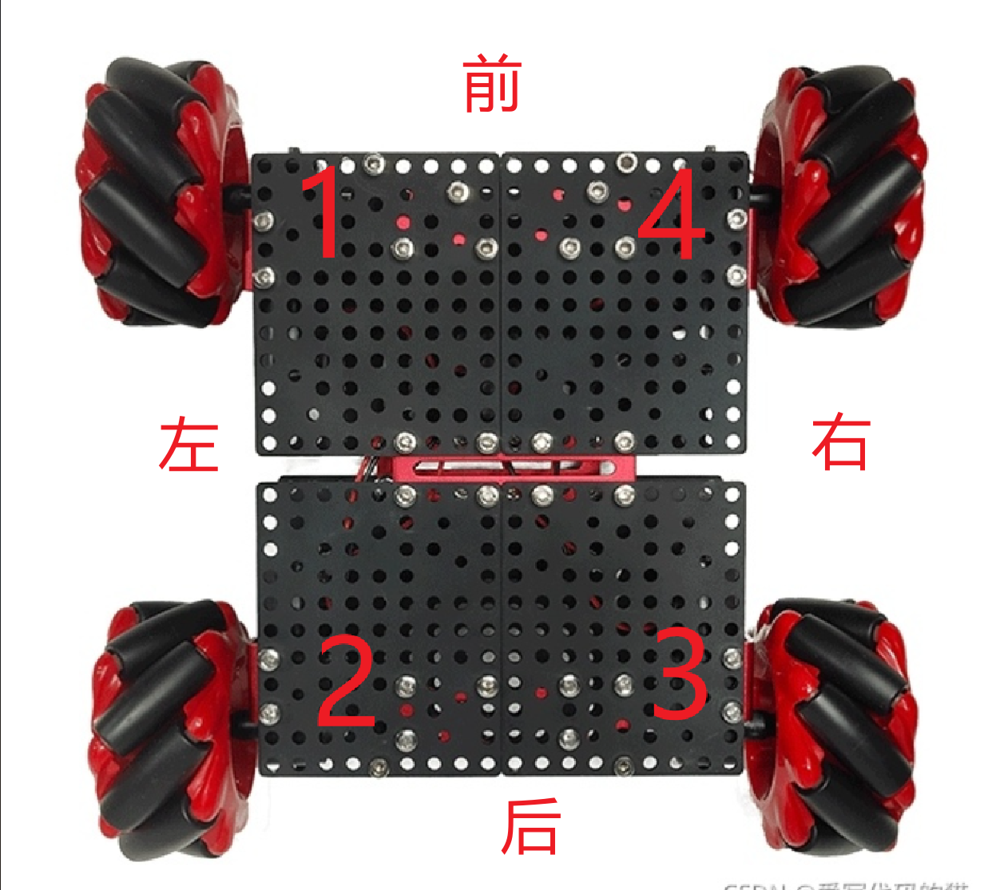
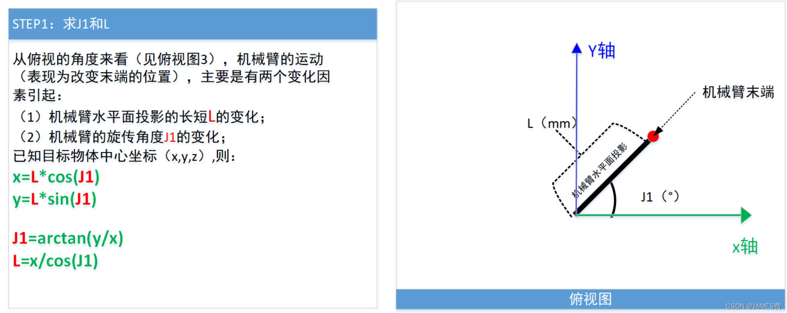
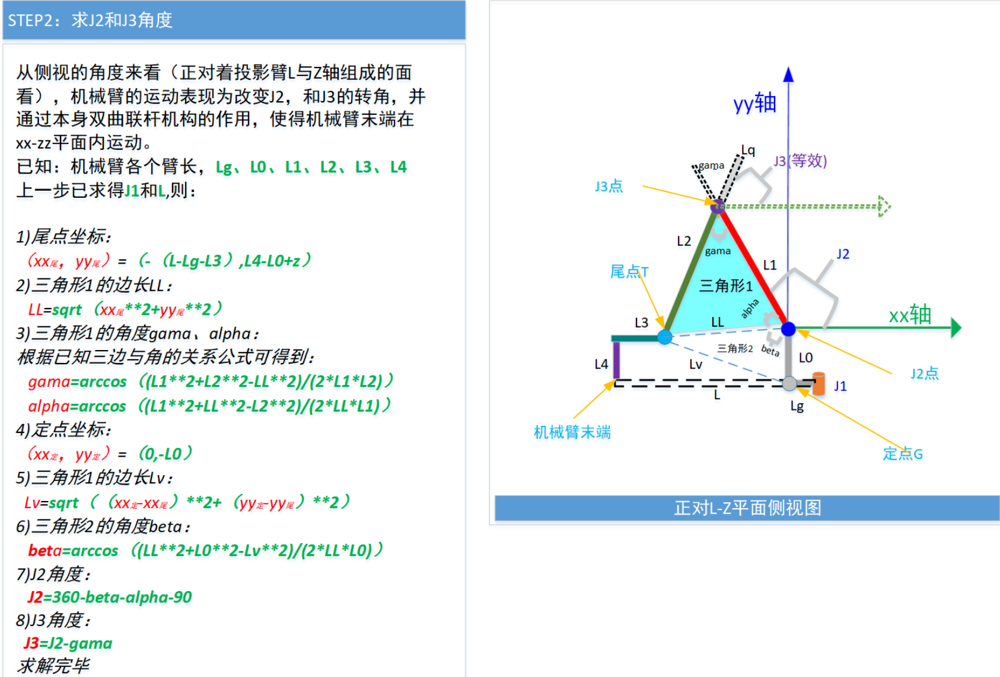

# 智能物流小车底盘控制

## 通信
---
### 串口命令控制:
使用UART2(RX->PA3, TX->PA2), 波特率115200, 命令字符串格式 四个命令ID标识字符+数字(正负数, 小数, 科学计数(e/E)), 例"XXXX345", "XXXX  5.67", "XXXX -1.2e-2". 默认命令"HELP",可展示所有已注册的命令ID.

### 串口波形输出(vofa+):
使用UART1(RX->PA10,TX->PA9),或直接接入板载COM端USB口 波特率9600(小蓝无线串口模块默认使用该波特率)

### imu
UART3, TX->PB10,RX->PB11, baudrate->115200.

### openmv
uart4, TX->PC10, RX->PC11, baudrate->9600.

## 底盘
---
### 电机驱动
使用TIM8 1/2/4通道及TIM1 1通道输出PWM.

| 电机ID  |  TIM通道  |  方向控制引脚A   |  方向控制引脚B |
| :----:  |  :-----:  |  :----:        |     :--:       |
|  1      |  TIM8->CH1->PC6 |     PA11       |   PA12        |
|  2      |  TIM8->CH2->PC7|     PG3        |   PG4        |
|  3      |  TIM1->CH1->PA8|     PG5        |   PG6        |
|  4      |  TIM8->CH4->PC9|     PG7        |   PG8        |

### encoder
使用定时器2,3,4,5.

| 电机ID  |  TIM |  A相    |  B相   |
| :----:  | :---:|  :----: | :--:   |
|  1      |  2   |  PA15   |   PB3  |
|  2      |  3   |  PB4    |   PB5  |
|  3      |  4   |  PB6    |   PB7  |
|  4      |  5   |  PA0    |   PA1  |

### 麦克纳姆轮组装方式及方向定义

## 机械臂
---
### 步进电机
定时器中(TIM10)断内翻转io电平输出脉冲.
| 定时器 | 脉冲引脚 | 方向引脚 |
|:--:   |:--:     |:--:      |
|TIM10  |PB8      |PB9       |
### 舵机
| id    | 定时器  | 通道  | 引脚 |
|:--:   |:--:     |:--:  |:--:  |
|小臂   |TIM12    |CH1   |PB14  |
|大臂   |TIM12    |CH2   |PB15  |
|抓手   |TIM14    |CH1   |PF9  |
|openmv 活动舵机| TIM9| CH1| PE5|

算法参考:[CSDN博客](https://blog.csdn.net/kanbide/article/details/125870326)

## 其它
---
### rgb
8位ws2812b rgb, spi+dma驱动, spi2, sck->PB13(未使用), mosi->PC3(接rgb信号引脚)
## 备注
- 板上sd卡槽并未支持sd卡插入检测, 但使用cubemx生成sdio驱动强制要求插入引脚检测, 故随意选择一个引脚用以生成代码, 生成后必须修改或重写 *uint8_t BSP_SD_IsDetected(void)* 函数, 使得sd卡检测有效, 否则将无法正常驱动sd卡.
- cjson解析文本内容较大, 改大heap(可9000).
- 拓展板上步进电机接口的标识错误